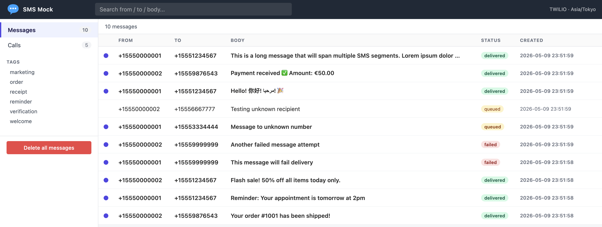

# SMS Mock Server

A mock server for Twilio SMS and Call APIs, perfect for development and testing without sending real messages or making real calls.



## Features

- **Twilio-compatible API** - Drop-in replacement for Twilio SMS/Call APIs
- **Configurable behavior** - Control success/failure scenarios via configuration
- **Callback simulation** - Automatic delivery status callbacks with configurable delays
- **Validation** - Toggleable authentication, phone format, and parameter validation
- **Web UI** - Mailbox-style interface to inspect received messages and calls, with user-defined tags supplied via the `X-Tags` HTTP header
- **Docker support** - Easy deployment with Docker and Docker Compose
- **SDK compatible** - Works with official Twilio SDKs (Python, Node.js, PHP, Ruby, Java, C#)

## Quick Start

### Option 1: Docker Hub (Easiest)

```bash
# Pull and run from Docker Hub. All configuration is via env vars.
docker run -d \
  -p 8080:8080 \
  -e SMS_MOCK_TWILIO_ACCOUNT_SID=ACXXXXXXXXXXXXXXXXXXXXXXXXXXXXXXXX \
  -e SMS_MOCK_TWILIO_AUTH_TOKEN=your_auth_token_here \
  -e SMS_MOCK_TWILIO_SUCCESS_NUMBERS=+15551234567,+15559876543 \
  -e SMS_MOCK_TWILIO_FAILURE_NUMBERS=+15559999999 \
  -e SMS_MOCK_TWILIO_ALLOWED_FROM_NUMBERS=+15550000001,+15550000002 \
  --name sms-mock-server \
  notfoundsam/sms-mock-server:latest

# Access the UI
open http://localhost:8080
```

### Option 2: Docker Compose

```bash
# Using the provided docker-compose.yml
docker compose up -d
```

The bundled `docker-compose.yml` contains a commented-out `environment:` block listing every supported variable — uncomment what you need.

### Persistence

By default the SQLite DB lives at `/tmp/mock_server.db` inside the container and is wiped on container restart — fine for the typical "fresh state per test run" use case. To persist data across restarts, set `SMS_MOCK_DB_PATH` to a path inside a mounted volume.

The bundled `docker-compose.yml` already wires this up using a named Docker volume:

```yaml
services:
  sms-mock-server:
    # ...
    environment:
      - SMS_MOCK_DB_PATH=/data/mock_server.db
    volumes:
      - sms-mock-data:/data

volumes:
  sms-mock-data:
```

The volume survives `docker compose down`. Remove it with `docker compose down -v` (or `docker volume rm sms-mock-data`).

If you'd rather store the DB in a host directory you can inspect directly (e.g. with `sqlite3 ./data/mock_server.db`), replace the volume mount with a bind mount:

```yaml
    volumes:
      - ./data:/data
```

On Linux the host directory must be writable by UID 65532 (the distroless `nonroot` user the container runs as): `mkdir -p ./data && sudo chown -R 65532:65532 ./data`. Docker Desktop on macOS/Windows handles UID translation automatically.

### Option 3: Local Go build

```bash
# Build a static binary into ./bin/sms-mock-server
make build

# Run it (configuration via env vars, e.g. for testing without auth):
SMS_MOCK_TWILIO_REQUIRE_AUTH=false ./bin/sms-mock-server

# Or skip the build step and use `go run`:
make run
```

Requirements: Go 1.25+ (matches `go.mod`'s declared toolchain). The binary is fully static (`CGO_ENABLED=0`) and embeds all templates and static assets, so the running binary needs nothing besides a writable directory for the SQLite DB. All configuration is supplied via environment variables.

## Configuration

The server is configured entirely via `SMS_MOCK_*` environment variables. Common (provider-agnostic) settings use the bare `SMS_MOCK_` prefix; Twilio-specific settings use `SMS_MOCK_TWILIO_`.

### Common settings

| Variable | Default | Description |
| --- | --- | --- |
| `SMS_MOCK_PORT` | `8080` | Listen port. The server always binds to `0.0.0.0`; restrict externally via Docker port-forwarding if needed. |
| `SMS_MOCK_TIMEZONE` | `UTC` | Timezone for UI date display (e.g. `America/New_York`, `Asia/Tokyo`) |
| `SMS_MOCK_DB_PATH` | `/tmp/mock_server.db` | SQLite DB path. Default is ephemeral; mount a host directory and override to persist. |
| `SMS_MOCK_PROVIDER` | `twilio` | Provider identifier. Only `twilio` is supported today. |
| `SMS_MOCK_MAX_MESSAGES` | `500` | Cap on stored messages; oldest are pruned when exceeded. `0` disables. |
| `SMS_MOCK_MAX_CALLS` | `500` | Cap on stored calls; oldest are pruned when exceeded. `0` disables. |
| `SMS_MOCK_MAX_AGE` | (empty) | TTL for messages and calls. Format `<int>h` or `<int>d` (e.g. `72h`, `3d`). Empty disables the TTL. |
| `SMS_MOCK_HIDE_DELETE_ALL_BUTTON` | `false` | Hides the "Delete all" button in the sidebar. Backend `/clear/*` endpoints remain functional. |

#### Retention pruner

When any of `SMS_MOCK_MAX_MESSAGES`, `SMS_MOCK_MAX_CALLS`, or `SMS_MOCK_MAX_AGE` is set, a background pruner runs every 60 seconds and trims the messages and calls tables. An immediate pass runs at startup so an over-capacity DB gets trimmed without waiting a minute. Pruning never touches `callback_logs` (audit trail) — it only deletes messages, calls, and their related `delivery_events`.

### Twilio settings

| Variable | Default | Description |
| --- | --- | --- |
| `SMS_MOCK_TWILIO_ACCOUNT_SID` | (empty) | Required when `REQUIRE_AUTH=true` |
| `SMS_MOCK_TWILIO_AUTH_TOKEN` | (empty) | Required when `REQUIRE_AUTH=true` |
| `SMS_MOCK_TWILIO_SUCCESS_NUMBERS` | (empty) | Comma-separated. Numbers go `queued → sent → delivered`. |
| `SMS_MOCK_TWILIO_FAILURE_NUMBERS` | (empty) | Comma-separated. Numbers go `queued → failed`. |
| `SMS_MOCK_TWILIO_ALLOWED_FROM_NUMBERS` | (empty) | Comma-separated. From-allowlist; only enforced when `CHECK_FROM_NUMBERS=true`. |
| `SMS_MOCK_TWILIO_REQUIRE_AUTH` | `true` | Validate HTTP Basic credentials |
| `SMS_MOCK_TWILIO_VALIDATE_PHONE_FORMAT` | `true` | Check E.164 phone format |
| `SMS_MOCK_TWILIO_CHECK_FROM_NUMBERS` | `true` | Require `From` to be in the allowlist |
| `SMS_MOCK_TWILIO_REQUIRE_PARAMETERS` | `true` | Validate required form fields |
| `SMS_MOCK_TWILIO_CALLBACK_DELAY_SECONDS` | `2` | Delay between status transitions |
| `SMS_MOCK_TWILIO_CALLBACK_RETRY_ATTEMPTS` | `3` | Total attempts for outbound callbacks |
| `SMS_MOCK_TWILIO_CALLBACK_RETRY_DELAY_SECONDS` | `5` | Delay between retry attempts |

### Number behavior

A destination number's outcome is determined by which list it appears in:

1. **In `SMS_MOCK_TWILIO_FAILURE_NUMBERS`** → status flow `queued → failed`. If `StatusCallback` is set, callbacks fire.
2. **In `SMS_MOCK_TWILIO_SUCCESS_NUMBERS`** → status flow `queued → sent → delivered`. If `StatusCallback` is set, callbacks fire.
3. **In neither list** → stays `queued` forever. No callbacks fire. This is also how the server runs in "callbacks-effectively-off" mode: leave both lists empty.

Failure list takes precedence if a number appears in both.

### Migration from `config.yaml`

Earlier versions of this project used a YAML config file. The mapping to env vars is straightforward:

| Old YAML key | New env var |
| --- | --- |
| `server.port` | `SMS_MOCK_PORT` |
| `server.timezone` | `SMS_MOCK_TIMEZONE` |
| `provider` | `SMS_MOCK_PROVIDER` |
| `database.path` | `SMS_MOCK_DB_PATH` |
| `twilio.account_sid` | `SMS_MOCK_TWILIO_ACCOUNT_SID` |
| `twilio.auth_token` | `SMS_MOCK_TWILIO_AUTH_TOKEN` |
| `twilio.registered_numbers` | `SMS_MOCK_TWILIO_SUCCESS_NUMBERS` (renamed) |
| `twilio.failure_numbers` | `SMS_MOCK_TWILIO_FAILURE_NUMBERS` |
| `twilio.allowed_from_numbers` | `SMS_MOCK_TWILIO_ALLOWED_FROM_NUMBERS` |
| `twilio.validation.*` | `SMS_MOCK_TWILIO_REQUIRE_AUTH` / `_VALIDATE_PHONE_FORMAT` / `_CHECK_FROM_NUMBERS` / `_REQUIRE_PARAMETERS` |
| `twilio.callbacks.delay_seconds` | `SMS_MOCK_TWILIO_CALLBACK_DELAY_SECONDS` |
| `twilio.callbacks.retry_attempts` | `SMS_MOCK_TWILIO_CALLBACK_RETRY_ATTEMPTS` |
| `twilio.callbacks.retry_delay_seconds` | `SMS_MOCK_TWILIO_CALLBACK_RETRY_DELAY_SECONDS` |

**Removed settings** (with no replacement):

- `twilio.default_behavior` — was effectively dead code (the dispatcher short-circuits on unknown numbers, so the field never observably affected outcomes). Numbers either appear in a list and resolve to that list's outcome, or they don't and stay queued.
- `twilio.callbacks.enabled` — removed. Callbacks now fire whenever the request supplies a `StatusCallback` URL *and* the destination number is in `SUCCESS_NUMBERS` or `FAILURE_NUMBERS`. To suppress all callbacks server-wide, leave both lists empty (no number progresses past `queued`, so no callbacks fire). The old combination "callbacks.enabled=false + populated lists" (status flow visible in the UI but no outbound HTTP) no longer has a server-side switch — the workaround is to point `StatusCallback` at a sink you control (e.g. the built-in `/callback-test`).

## SDK Integration

### Python

```python
from twilio.rest import Client
from twilio.http.http_client import TwilioHttpClient

account_sid = 'ACXXXXXXXXXXXXXXXXXXXXXXXXXXXXXXXX'
auth_token = 'your_auth_token_here'

# Point to mock server
http_client = TwilioHttpClient()
http_client.api_base_url = 'http://localhost:8080'

client = Client(account_sid, auth_token, http_client=http_client)

# Send SMS
message = client.messages.create(
    to='+15551234567',
    from_='+15550000001',
    body='Hello from mock server!',
    status_callback='http://your-app.com/callback'
)

print(f"Message SID: {message.sid}")
```

### Node.js

```javascript
const twilio = require('twilio');

const accountSid = 'ACXXXXXXXXXXXXXXXXXXXXXXXXXXXXXXXX';
const authToken = 'your_auth_token_here';

const client = twilio(accountSid, authToken, {
    lazyLoading: true,
    accountSid: accountSid,
    apiBaseUrl: 'http://localhost:8080'
});

// Send SMS
const message = await client.messages.create({
    to: '+15551234567',
    from: '+15550000001',
    body: 'Hello from mock server!',
    statusCallback: 'http://your-app.com/callback'
});

console.log(`Message SID: ${message.sid}`);
```

### PHP

```php
<?php
require_once 'vendor/autoload.php';
use Twilio\Rest\Client;

$accountSid = 'ACXXXXXXXXXXXXXXXXXXXXXXXXXXXXXXXX';
$authToken = 'your_auth_token_here';
$mockServerUrl = 'http://localhost:8080';

$client = new Client($accountSid, $authToken, $accountSid, null, $mockServerUrl);

$message = $client->messages->create(
    '+15551234567',
    [
        'from' => '+15550000001',
        'body' => 'Hello from mock server!',
        'statusCallback' => 'http://your-app.com/callback'
    ]
);

echo "Message SID: " . $message->sid . "\n";
?>
```

## API Endpoints

### Send SMS

```
POST /2010-04-01/Accounts/{AccountSid}/Messages.json
```

**Parameters:**
- `From` (required) - Sender phone number
- `To` (required) - Recipient phone number
- `Body` (required) - Message text
- `StatusCallback` (optional) - Callback URL for delivery status

**Response:** Standard Twilio message resource JSON

### Make Call

```
POST /2010-04-01/Accounts/{AccountSid}/Calls.json
```

**Parameters:**
- `From` (required) - Caller phone number
- `To` (required) - Callee phone number
- `Url` (required) - TwiML URL
- `StatusCallback` (optional) - Callback URL for call status

**Response:** Standard Twilio call resource JSON

### Health Check

```
GET /health
```

**Response:**
```json
{
  "status": "healthy",
  "version": "1.0.0",
  "provider": "twilio",
  "timestamp": "2024-01-15T10:30:00Z",
  "statistics": {
    "messages": 42,
    "calls": 15,
    "callbacks": 84
  }
}
```

### Callback Test Endpoint

```
POST /callback-test
```

A test endpoint that accepts POST requests (used for testing callbacks locally without external URLs).

**Response:** `{"status": "received", "data": {...}}`

### Clear Data

```
POST /clear/messages    # Clear all messages
POST /clear/calls       # Clear all calls
POST /clear/callbacks   # Clear all callback logs
POST /clear/all         # Clear all data
```

## Web UI

Access the web UI at `http://localhost:8080`. The layout is a mailbox-style
inbox: top bar with search, left sidebar with type nav and tags, list pane
that opens records as full pages.

- **Messages** (`/`) — list of received SMS, newest first. Unread rows are bold
  with a leading dot.
- **Calls** (`/calls`) — list of calls in the same shape (no message body).
- **Tags** — sidebar section that appears only when at least one record of the
  active type carries a tag. Tags are user-defined and per-type (the messages
  sidebar shows only tags attached to messages; same for calls). Click a tag
  to filter; click again or click another tag to switch (single-select).
  See [Tagging Messages](#tagging-messages) below.
- **Search** — top-bar input. Free text filters across `From`, `To`, and
  `Body` (calls: `From`/`To` only). Inline `tag:foo` operators are supported
  in the same box (e.g. `verify tag:auth` finds messages containing "verify"
  AND tagged `auth`). Live as you type; press Enter for a shareable URL.
- **Detail view** — clicking a row opens `/view/messages/{sid}` (or
  `/view/calls/{sid}`). Marks the record read on open. Shows a one-line
  callback delivery summary if any webhook was sent and the record's tags as
  pill chips. Filter state is preserved through to the Back button.
- **Delete** — per-row delete on hover; "Delete all" button at the bottom of
  the sidebar (calls `POST /clear/messages` or `/clear/calls`).
- **Real-time** — list and sidebar poll every 3 seconds via HTMX, so new
  records appear without a manual reload.

The dashboard, the Callbacks page, and modal-style detail views are gone.
Callback delivery info now lives inline on the relevant message/call detail
page; raw callback log rows remain queryable via
`SELECT * FROM callback_logs;` against the SQLite DB.

### Tagging Messages

Clients can attach arbitrary tags to a message or call by sending an `X-Tags`
HTTP header on the Twilio-shaped POST. The Twilio request body is unchanged —
tags are out-of-band metadata for the mock UI's benefit only.

```bash
curl -X POST http://localhost:8080/2010-04-01/Accounts/AC1/Messages.json \
  -H 'X-Tags: verification, auth' \
  -d 'From=%2B15550000001&To=%2B15551234567&Body=Your+code+is+1234'
```

- **Format**: comma-separated names. Whitespace around each name is trimmed,
  empty entries are dropped, names are lowercased on the server, duplicates
  are folded.
- **Multiple tags**: a record can carry zero or more tags. The query
  `tag:verification tag:auth` finds records that have both (AND-semantics).
- **Per-type isolation**: a tag attached only to a call appears in the Calls
  sidebar, not in the Messages sidebar.

## Callback Flow

When you send an SMS/call with a `StatusCallback` URL, the mock server will:

1. Accept the request and return immediately (status: `queued`)
2. Wait for `delay_seconds` (default: 2s)
3. Send status update callbacks:
   - **SMS Success**: queued → sent → delivered
   - **SMS Failure**: queued → failed
   - **Call Success**: queued → ringing → in-progress → completed
   - **Call Failure**: queued → failed
4. Retry failed callbacks up to `retry_attempts` times

## Docker Compose with Your App

```yaml
services:
  sms-mock-server:
    image: notfoundsam/sms-mock-server:latest
    ports:
      - "8080:8080"
    networks:
      - app-network

  your-app:
    build: ./your-app
    depends_on:
      - sms-mock-server
    environment:
      - TWILIO_API_BASE_URL=http://sms-mock-server:8080
      - TWILIO_ACCOUNT_SID=ACXXXXXXXXXXXXXXXXXXXXXXXXXXXXXXXX
      - TWILIO_AUTH_TOKEN=your_auth_token_here
    networks:
      - app-network

networks:
  app-network:
    driver: bridge
```

## Error Scenarios

The mock server emulates common Twilio errors:

| Error | HTTP Status | When |
|-------|-------------|------|
| Authentication Failed | 401 | Invalid credentials |
| Missing Parameter | 400 | Required param missing |
| Invalid Phone Number | 400 | Invalid E.164 format |
| Invalid From Number | 400 | From not in allowed list |

## Development

### Makefile Commands

```bash
# Go build / test
make build         # Build static binary into ./bin/sms-mock-server
make run           # Run the server directly (go run)
make test          # Go unit tests
make test-race     # Go unit tests with -race
make lint          # golangci-lint run ./... (41 linters, see .golangci.yml)
make tidy          # go mod tidy
make version       # Print the build version that `make build` would stamp

# Docker / docker compose (uses published image from Docker Hub)
make up               # Pull latest image + start container
make stop             # Stop container
make restart          # Restart container
make clean            # Stop + remove volumes
make logs             # Tail container logs
make docker-snapshot  # Build a local image via goreleaser (no push)

# Data helpers
make seed          # Seed sample messages/calls (against running server on :8080)

make help          # Show this list
```

### Local Development

The server is a single Go binary; templates, static assets, and migrations are all embedded at build time. No external runtime tooling is required.

```bash
# Run unit tests
go test ./...
go test -race ./...        # with the race detector

# Lint (requires golangci-lint installed)
make lint

# Run the server (auto-reloading is not built in; rebuild + restart on changes)
make run
```

Test coverage:
- **Per-package unit tests** (`app/<pkg>/*_test.go`) using stdlib `testing` + `testify`. Includes table-driven validation matrices, fakes for storage / HTTP / clock.
- **End-to-end smoke test** (`app/main_test.go`) builds the full stack via `httptest.NewServer` and exercises POST Messages → persistence → `/health` → messages page → static asset → `/clear/all`.
- All HTTP endpoints (Twilio Messages/Calls, `/health`, `/clear/*`, `/callback-test`, `/favicon.ico`, mailbox/detail pages, UI fragments) are covered by handler-level tests in `app/httpapi/` and `app/ui/`.

## Project Structure

```
sms-mock-server/
├── app/                       # all Go source (flat layout, single binary)
│   ├── main.go                # entrypoint
│   ├── main_test.go           # end-to-end smoke test (httptest.NewServer)
│   ├── embedded.go            # //go:embed templates + static
│   ├── config/                # env-var config loader + validation
│   ├── storage/               # SQLite store, embedded migrations
│   ├── provider/              # Provider interface + types (ValidationError, etc.)
│   │   └── twilio/            # Twilio adapter (auth, validation, outcome)
│   ├── template/              # text/template + html/template engine
│   ├── callback/              # Async dispatcher: worker pool + Clock-driven retries
│   ├── prune/                 # Background retention sweeper (60s tick)
│   ├── httpapi/               # Twilio API routes, /health, /clear/*, middleware
│   ├── ui/                    # Mailbox pages, detail views, HTMX fragment handlers
│   ├── clock/                 # Clock interface (real + fake for tests)
│   ├── testutil/              # Shared fakes for unit tests
│   ├── templates/             # JSON response/error + HTML UI templates (embedded)
│   │   ├── responses/twilio/
│   │   ├── errors/twilio/
│   │   └── ui/                # base.html + page templates + fragments/
│   └── static/                # CSS, JS, favicon (embedded)
├── scripts/
│   └── seed_data.sh           # Seed sample messages/calls via curl
├── docs/
│   ├── DESIGN.md              # Architecture documentation
│   └── plans/                 # Implementation plans (history)
├── .github/workflows/         # CI (test + lint + shellcheck) + release (goreleaser)
├── Makefile                   # Build / test / docker targets
├── Dockerfile                 # Multi-stage source build (used by docker compose)
├── Dockerfile.release          # Single-stage prebuilt-binary copy (used by goreleaser)
├── docker-compose.yml
├── .golangci.yml              # Linter config (41 linters)
├── .goreleaser.yml            # Release automation (binaries + Docker Hub image)
└── go.mod / go.sum
```

## Troubleshooting

**Authentication errors even with correct credentials:**
- Make sure `SMS_MOCK_TWILIO_ACCOUNT_SID` and `SMS_MOCK_TWILIO_AUTH_TOKEN` are set
- Or set `SMS_MOCK_TWILIO_REQUIRE_AUTH=false` for quick testing

**Callbacks not being received:**
- Verify the `To` number is in `SMS_MOCK_TWILIO_SUCCESS_NUMBERS` (success flow) or `SMS_MOCK_TWILIO_FAILURE_NUMBERS` (failure flow). Numbers in *neither* list stay queued forever and produce no callbacks — this is also the way to disable callbacks entirely (leave both lists empty).
- Verify your callback URL is accessible from the mock server
- For local testing, use the built-in `/callback-test` endpoint: `http://localhost:8080/callback-test`
- Inspect callback delivery on the message/call detail page (`/view/messages/{sid}` shows a "Callback delivery" summary if any webhooks were sent for that record). For raw rows, query the SQLite DB directly: `sqlite3 /tmp/sms-mock.db 'SELECT * FROM callback_logs;'`

**Phone number validation errors:**
- Use E.164 format: `+15551234567` (with `+` and country code)
- Or set `SMS_MOCK_TWILIO_VALIDATE_PHONE_FORMAT=false`
- Note: `+1555...` numbers (NANP fictional-use) are **rejected by libphonenumber** when phone format validation is on. Use real-looking numbers like `+12025550100` (DC area code) for testing with strict validation, or disable the format check for permissive testing.

## License

MIT License - See [docs/DESIGN.md](docs/DESIGN.md) for architecture details

## Contributing

Contributions welcome! This is a development tool, so focus on:
- Simplicity over features
- Compatibility with Twilio SDKs
- Easy configuration and debugging
